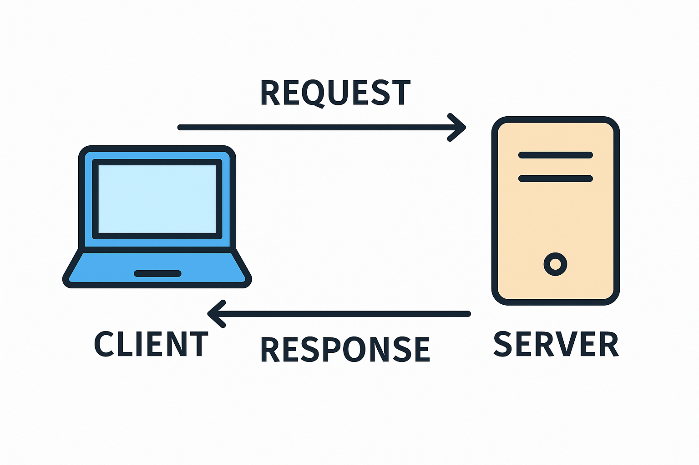

# 🌐 What Happens When We Access a Webpage



---


## 📥 Overview: Request and Response Flow

1. **Client (Browser)** sends an **HTTP Request** to the **Server**  
   🔸 *Example:* "Please give me the homepage of `example.com`"

2. **Server** processes the request and sends back an **HTTP Response**  
   🔸 The response includes the **webpage files** (like HTML, CSS, JS)

3. **Browser** receives the response and **renders the page**  
   🔸 This is what the user sees on the screen

---

## 🪜 Step-by-Step Breakdown

### 🔹 1. **User Enters a URL in the Browser**

- **Example:** `https://www.google.com/search`
- This is called a **URL** (Uniform Resource Locator)
- The URL usually contains:
  - **Protocol:** `https`
  - **Domain Name:** `google.com`
  - **Path/Resource:** `/search`

---

### 🔹 2. **DNS Lookup** – Resolving the Domain Name

- The browser asks:
  > “What is the IP address of `www.google.com`?”

- It sends a request to a **DNS server** (Domain Name System)
- DNS translates the **domain name** into an **IP address**, e.g.:
  ```
  142.250.186.14
  ```
- ✅ Because servers are located using IP addresses, not names

---

### 🔹 3. **Browser Sends an HTTP Request to the Server**

- Using the IP address, the browser sends an **HTTP GET request** like:

  ```
  GET /search HTTP/1.1
  Host: www.google.com
  ```

- Structure of an HTTP Request:
  1. **Start Line**: Method (`GET`, `POST`, etc.), Path, HTTP Version  
  2. **Headers**: Metadata (e.g., `User-Agent`, `Accept`)  
  3. *(Optional)* **Body**: Sent with `POST`, `PUT`, etc.

---

### 🔹 4. **Server Sends an HTTP Response**

- The server receives the request, processes it, and sends back a response like:

  ```
  HTTP/1.1 200 OK
  Content-Type: text/html
  ```

- Structure of an HTTP Response:
  1. **Status Line**: Version, Status Code, Message (e.g., `200 OK`)
  2. **Headers**: Information like `Content-Type`, `Content-Length`
  3. **Body**: The actual content (HTML, CSS, JS, JSON…)

✅ The server may also send:
- Images  
- CSS files  
- JavaScript files  
- Fonts or other assets

---

### 🔹 5. **Browser Receives and Renders the Webpage**

- The browser:
  - Parses the HTML
  - Downloads and applies CSS
  - Loads and executes JavaScript
  - Builds the final visual layout

✅ This is what the user **sees** and interacts with

---

## ✅ Summary Diagram:

```
You → Enter URL
→ DNS Lookup → Get IP
→ Send HTTP Request
→ Server Sends HTTP Response
→ Browser Renders Page
```

---

### 💡 Tip:
Use browser tools (Right-click → Inspect → Network tab) to observe real request/response behavior in action!